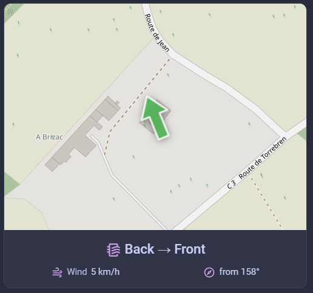
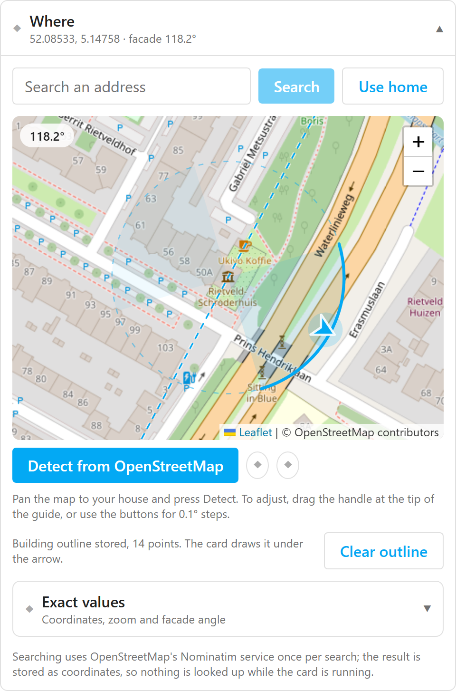

# Airflow Map Card

[](https://github.com/striekels/airflow-map-card/releases)
[](https://github.com/striekels/airflow-map-card/actions/workflows/ci.yml)
[](https://hacs.xyz/)
[](LICENSE)

**Should you open the windows?** This Home Assistant card draws your house on a live map,
points an arrow the way the wind is actually travelling, and tells you whether that airflow
runs front to back, back to front, or merely across the front of the house.

<p align="center">
  
</p>

It replaces the usual `picture-elements` plus static PNG plus `card_mod` recipe. The map is
live, so it stays sharp at any zoom and never needs regenerating when you move the view, and
the facade angle is detected from OpenStreetMap rather than guessed by dragging.

## Stability

The configuration format is the contract. From 1.0 it changes only with a major version, and
never silently: an option that stops working is removed and named in
[CHANGELOG.md](CHANGELOG.md) rather than left in place doing nothing.

The card has been exercised against a small number of Home Assistant instances and weather
integrations, so bug reports are genuinely useful, particularly if your integration reports
wind in a unit or a bearing convention that produces a plausible but wrong answer. Include
your Home Assistant version, the card version from the browser console, and your YAML.

## Contents

- [What it does](#what-it-does)
- [Requirements](#requirements)
- [Install](#install)
- [Quick start](#quick-start)
- [How the direction works](#how-the-direction-works)
- [Options](#options)
- [Attribution and fair use](#attribution-and-fair-use)
- [Troubleshooting](#troubleshooting)
- [Development](#development)
- [Contributing](#contributing)
- [Status](#status)

## What it does

- **Live map** of your house from OpenStreetMap or CARTO tiles, following your dashboard's
  light or dark theme.
- **Wind arrow** driven by any `weather` entity, pointing the way the air actually travels.
- **Airflow verdict** — front to back, back to front, sideways, or too weak to matter —
  computed from the wind bearing and the way your house faces.
- **One-click facade alignment**: the editor reads your building's outline from
  OpenStreetMap, works out which wall faces the street, and sets the angle for you. Click a
  neighbouring house if it guessed wrong.
- **Optional animated wind flow** over the map, so speed is visible and not just a number.
- **Configurable readouts** underneath: built-in values, any entity or attribute, or Jinja
  templates.

## Requirements

- Home Assistant **2024.11** or newer (the card uses the sections-layout grid API).
- A `weather` entity that reports `wind_bearing` and `wind_speed`, or sensors that do.
- Browser access to a tile server. The defaults are the public OpenStreetMap and CARTO
  endpoints; see [Attribution and fair use](#attribution-and-fair-use).

## Install

### HACS (custom repository)

1. HACS → ⋮ → **Custom repositories**
2. Add this repository's URL with category **Dashboard** (older HACS calls it
   **Lovelace** or **Plugin**)
3. Install **Airflow Map Card**
4. Hard-refresh your browser (Ctrl+Shift+R). A normal reload will not pick up a newly
   registered resource.

### Manual

Download `airflow-map-card.js` from the latest release into `config/www/`, then add it under
Settings → Dashboards → ⋮ → **Resources** as a **JavaScript module**:

```
/local/airflow-map-card.js
```

If you are updating a manually installed copy, append a version query so the browser cannot
serve you a cached build: `/local/airflow-map-card.js?v=1.0.0`.

## Quick start

Add the card from the dashboard card picker and it works immediately: your Home Assistant
home coordinates, the first `weather.*` entity it finds, and three default rows. Everything
below is optional refinement, available in the visual editor.

```yaml
type: custom:airflow-map-card
title: Airflow
location:
  latitude: 51.2194
  longitude: 4.4025
  zoom: 18
house:
  facade_bearing: 45
wind:
  entity: weather.home
rows:
  - source: airflow
    size: large
  - source: speed
    name: Wind
  - source: bearing
    prefix: from
    name: false
```

## How the direction works

Home Assistant's `wind_bearing` is the direction the wind comes **from**. The arrow points
the way the air actually travels, i.e. the reciprocal.

`house.facade_bearing` is the direction the **front of your house faces**: `0` = north,
`90` = east. With that, the card classifies the flow:

| Angle between the wind's origin and the facade | Result           |
| ---------------------------------------------- | ---------------- |
| less than `sideways_from` (default 45°)        | **Front → Back** |
| more than `180 - sideways_from`                | **Back → Front** |
| anything in between                            | **Sideways**     |
| speed below `weak_below`                       | **Weak wind**    |

If you already have a template sensor doing this, keep it — set `airflow.mode: entity` and
point `airflow.entity` at it. The card still colours the arrow from its own calculation.

> **Units:** `airflow.weak_below` is read in whatever unit your wind source reports. No
> conversion is applied, so `5` means 5 km/h against a km/h sensor and 5 m/s against an m/s
> one. The visual editor shows the detected unit in the field label.

## Options

### Top level

| Option        | Type    | Default                 | Description                                                   |
| ------------- | ------- | ----------------------- | ------------------------------------------------------------- |
| `title`       | string  | —                       | Card header. Omit for no header.                              |
| `flow`        | boolean | `false`                 | Animated wind flow over the map. See [Wind flow](#wind-flow). |
| `rows`        | list    | airflow, speed, bearing | Info rows. See [Rows](#rows).                                 |
| `tap_action`  | action  | —                       | Standard Lovelace action, fired by tapping the arrow.         |
| `hold_action` | action  | —                       | The same, on long press or right click.                       |

### `location`

| Option      | Type   | Default           | Description                             |
| ----------- | ------ | ----------------- | --------------------------------------- |
| `latitude`  | number | HA home latitude  |                                         |
| `longitude` | number | HA home longitude |                                         |
| `zoom`      | number | `18`              | 1–19. 18–19 shows individual buildings. |

The editor has an address search box. It resolves the address once, when you press Search,
and stores the result as coordinates — nothing is looked up while the card is running.

### `house`

| Option                  | Type   | Default | Description                                                                   |
| ----------------------- | ------ | ------- | ----------------------------------------------------------------------------- |
| `facade_bearing`        | number | `0`     | Compass direction the front of the house faces.                               |
| `facade_bearing_entity` | entity | —       | Take it from an entity instead, e.g. an `input_number` you can tune live.     |
| `footprint`             | list   | —       | Building outline as `[lat, lon]` pairs. Written by Detect; drawn on the card. |

#### Aligning the facade

<p align="center">
  
</p>

Open the card editor and look for **Where**. Pan the map to your house, press
**Detect from OpenStreetMap**, and you are usually done.

Detection runs at whatever the map is centred on, not at the coordinates already in the
config, so panning is how you tell it where to look. It draws every building it found,
labelled with its house number, picks the one under the centre, reads that outline's walls,
and faces the one pointing at the street.

Which street matters on a corner. If the building carries an `addr:street` tag, the wall is
faced towards the road of that name rather than whichever road happens to be closest, since
on a corner plot the side street is usually nearer than the one the house is numbered on.
Without a matching name it falls back to nearest.

**It also moves the card's position onto the building it settled on**, so the map and the
facade angle always describe the same house. This is the easiest way to set your location:
pan, detect, done.

Detection also stores the outline in `house.footprint`, and the card draws it faintly under
the arrow, so the arrow reads against the actual shape of your house rather than a generic
map tile. Nothing is looked up while the card runs: the outline is a handful of coordinate
pairs in the config.

The outline belongs to one building, so anything that moves the card without detecting
again, an address search, **Use home**, or typing new coordinates, clears it. Delete
`house.footprint` if you would rather the card did not draw it.

**If it picked the wrong building, click yours on the map.** The detection re-runs against
that outline. This is worth doing whenever the highlighted house is not the right number:
the automatic choice depends on your coordinates landing inside the correct polygon, which
is the one part of the setup you cannot otherwise check.

If your building is not mapped at all, or detection picks the wrong _wall_, drag the line
onto the front of the house instead. It snaps to a wall whenever an outline is loaded, so
you get the building's real angle rather than an eyeballed one.

Three levels of adjustment, coarse to fine:

| Control                           | Step                                                            |
| --------------------------------- | --------------------------------------------------------------- |
| Drag the line                     | free, snapping to a wall within 8° (hold Shift to drag past it) |
| Arrow keys, with the line focused | 1°, or 5° with Shift                                            |
| The rotate buttons                | 0.1°                                                            |

The lookup runs once per button press and only in the editor. The result is stored as a
single number, so nothing is queried while the card is running.

#### The guide overlay

While you align, the editor draws a guide over the map:

- a **thin dashed line spanning the whole map** — rotate it until it lies along the front
  wall of your house. It runs edge to edge on purpose, because alignment error shows up at
  the ends of a long line, and it is dashed so the roofline stays visible underneath;
- a **chevron on the rim** marking which side of that line is the front;
- **two shaded sectors** — wind arriving from either one blows through the house rather
  than across it. The solid-edged sector is the front. Their width is `sideways_from`, so
  you can see what that threshold means for your building.

The line spans the map so that it can be sighted along, which also puts it in the way of
panning. Use the **eye button** beside the bearing readout to hide it while you move the
map, then show it again to fine-tune.

The editor's map is always light whatever your dashboard theme, because building outlines
are considerably easier to see against it. The card's own basemap is separate and follows
`map.tiles`.

The guide exists only in the editor. Once saved, the card shows the map, the arrow and your
rows, with no alignment furniture.

### `wind`

| Option           | Type        | Default | Description                                                         |
| ---------------- | ----------- | ------- | ------------------------------------------------------------------- |
| `entity`         | `weather.*` | —       | Source for speed, bearing and gust.                                 |
| `speed_entity`   | `sensor.*`  | —       | Override just the speed.                                            |
| `bearing_entity` | `sensor.*`  | —       | Override just the bearing. Accepts degrees or compass text (`NNW`). |
| `gust_entity`    | `sensor.*`  | —       | Override just the gust.                                             |

An override always wins over the weather entity. An override that is `unavailable` reads as
no data rather than silently falling back.

### `airflow`

| Option          | Type                           | Default                 | Description                                                                      |
| --------------- | ------------------------------ | ----------------------- | -------------------------------------------------------------------------------- |
| `mode`          | `compute` \| `entity` \| `off` | `compute`               |                                                                                  |
| `entity`        | entity                         | —                       | Label source when `mode: entity`.                                                |
| `weak_below`    | number                         | `5`                     | In the wind source's unit.                                                       |
| `sideways_from` | number                         | `45`                    | Degrees, 1–90.                                                                   |
| `labels`        | map                            | English/Dutch built-ins | Override any of `front_to_back`, `back_to_front`, `sideways`, `weak`, `unknown`. |

### `arrow`

| Option       | Type                 | Default    | Description |
| ------------ | -------------------- | ---------- | ----------- |
| `size`       | number               | `130`      | Pixels.     |
| `color_mode` | `airflow` \| `fixed` | `airflow`  |             |
| `color`      | CSS colour           | per bucket |             |
| `hide`       | boolean              | `false`    |             |

### `map`

| Option         | Type                                             | Default     | Description                                                                                          |
| -------------- | ------------------------------------------------ | ----------- | ---------------------------------------------------------------------------------------------------- |
| `tiles`        | `auto` \| `osm` \| `carto-light` \| `carto-dark` | `auto`      | `auto` follows the dashboard's light/dark theme. Anything else pins the basemap regardless of theme. |
| `tile_url`     | string                                           | —           | Your own tile server. Overrides `tiles`.                                                             |
| `attribution`  | boolean                                          | `true`      |                                                                                                      |
| `interactive`  | boolean                                          | `false`     | Allow pan and zoom.                                                                                  |
| `filter`       | CSS filter                                       | per basemap | e.g. `brightness(0.62) contrast(1.05)`.                                                              |
| `aspect_ratio` | string                                           | `4 / 3`     |                                                                                                      |
| `height`       | number                                           | —           | Fixed pixel height; overrides `aspect_ratio`.                                                        |

### Wind flow

Set `flow: true` for an animated flow of particles carried by the wind, drawn over the map.
Off by default, because it animates continuously and a dashboard often runs all day on a
wall tablet.

```yaml
flow: true
```

**It is a uniform flow, not a wind field.** Windy and similar maps advect particles through a
grid of vectors from a weather model, which is where their swirls come from. A Home Assistant
weather entity reports one vector at one point, so every particle here moves in the same
direction at the same speed. The flow does not bend around your house, and any resemblance to
how air actually moves around a building would be invented.

What it adds is speed. The arrow states direction precisely and looks identical at 4 km/h and
40 km/h; particle velocity and density make that difference visible without reading a number.
Colour follows the same airflow classification as the arrow.

It pauses when scrolled out of view, when the browser tab is hidden and when the card is
removed, and draws a single still frame if you have reduced motion enabled.

### Rows

Each row is one of three kinds.

**Built-in value** — no entity needed:

```yaml
- source: airflow # airflow | speed | gust | bearing | cardinal
  size: large
```

**Entity:**

```yaml
- entity: sensor.outside_temperature
  attribute: humidity # optional: read an attribute instead of the state
  precision: 1
```

**Template** — rendered over the websocket API, same as any other template card:

```yaml
- template: "{{ states('sensor.window_airflow_direction') }}"
  icon: mdi:window-open
```

Shared options: `name` (or `false` to hide), `icon` (or `false`), `prefix`, `suffix`,
`unit` (or `false`), `precision`, `size` (`small` / `normal` / `large`), `tap_action`.

A `large` row takes the full width on its own line; `normal` and `small` rows share a line.

## Attribution and fair use

The default basemaps are served by OpenStreetMap and CARTO under their public tile usage
policies. Attribution is shown by default — please leave it on. If you embed this card on
many dashboards or run kiosk displays that reload constantly, point `tile_url` at your own
tile server.

Address search uses OpenStreetMap's Nominatim service, one request per search, from the
editor only.

## Troubleshooting

**"Custom element doesn't exist: airflow-map-card"**
The resource did not load. Check the file is at `config/www/airflow-map-card.js`, that the
resource is registered as a **JavaScript module** and not "JavaScript file", and hard-refresh.

**The card renders but the map area is blank**
Almost always the map container having no height. The card reports map failures on its own
face, so if it says nothing, open the browser console. Setting `map.height` to a fixed pixel
value is a quick way to confirm.

**The arrow points the opposite way to what I expect**
`wind_bearing` in Home Assistant is the direction the wind comes _from_; the arrow points the
way the air travels, which is the reciprocal. If it is still wrong, your integration may be
reporting a travel direction instead — override it with `wind.bearing_entity`.

**Airflow says Sideways when it looks head-on**
Re-check `house.facade_bearing` in the editor with the alignment guide. The common
mistake is aligning to a side wall rather than the front; the editor's Detect button and the
building outline exist to prevent exactly that.

**Detect says "No building mapped here"**
Your building may simply not be mapped in OpenStreetMap yet. Buildings mapped as relations
rather than ways are supported, so that is no longer the likely cause. Check
[openstreetmap.org](https://www.openstreetmap.org/) for your address, and drag the guide
handle to set the angle by hand in the meantime.

**Detect says OpenStreetMap is busy**
Overpass rate-limits aggressively. Wait a minute and try again.

## Development

```bash
npm install
npm run dev
```

Three harnesses run against a mock `hass` object, with no Home Assistant instance needed:

- `http://localhost:5173` — the card, with sliders for wind bearing, speed and facade
  orientation, and a toggle for the animated flow.
- `http://localhost:5173/picker.html` — the editor's facade picker, including live
  OpenStreetMap detection.
- `http://localhost:5173/editor.html` — the whole visual editor, with the resulting YAML
  beside it. The Home Assistant frontend elements it needs are stubbed in `dev/ha-stubs.ts`.

```bash
npm test          # compass maths, airflow, rows, footprint geometry, editor schemas
npm run lint
npm run build     # produces dist/airflow-map-card.js
```

The build uses esbuild directly rather than Vite's library mode, which does not minify here;
see `scripts/build.mjs`. Vite is used only for the dev server.

`CLAUDE.md` describes the architecture and the conventions worth knowing before changing
anything.

## Contributing

Issues and pull requests are welcome.

`main` is protected: changes reach it through a pull request that passes CI and is approved
by the maintainer. Fork the repository, work on a branch, and open a PR against `main`.

Most useful right now:

- **Screenshots from other setups.** Different themes, integrations and house shapes. See
  [images/README.md](images/README.md).
- **Reports from other weather integrations.** The airflow maths has been checked against one
  setup; wind units and `wind_bearing` conventions differ between integrations, and a
  mismatch produces a plausible wrong answer rather than an obvious failure.
- **Buildings the facade detection gets wrong.** An OpenStreetMap link plus what it should
  have picked is enough to turn into a test.

Before opening one:

- `npm test`, `npm run lint` and `npm run build` should all pass.
- Keep compass and geometry maths in `src/data/bearing.ts` and `src/data/footprint.ts`, and
  add tests there. Sign errors in this domain produce plausible-looking wrong answers rather
  than obvious failures, which is why that code is isolated and heavily tested.
- Follow Conventional Commits.

## Status

[CHANGELOG.md](CHANGELOG.md) records what changed and, more usefully, why.
[BACKLOG.md](BACKLOG.md) records what is known to be missing or wrong, including bugs not yet
fixed and decisions deliberately deferred. Both are written to be read.

## Credits

Basemaps © [OpenStreetMap](https://www.openstreetmap.org/copyright) contributors and
[CARTO](https://carto.com/attributions). Geocoding by
[Nominatim](https://nominatim.org/); building outlines via the
[Overpass API](https://overpass-api.de/). Mapping by [Leaflet](https://leafletjs.com/).

## License

[MIT](LICENSE)
